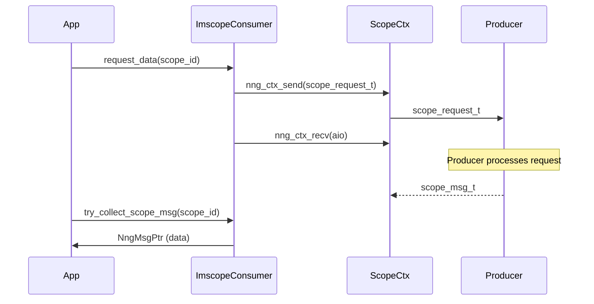

# imscope_consumer Analysis and Description

The `imscope_consumer` is the client-side component of the `imscope` project, responsible for discovering producers and requesting data through a high-performance, asynchronous communication layer based on **NNG (Nanomsg Next Gen)**.

## Architecture and Discovery Process

The consumer is designed around a **REQ/REP** pattern, where it acts as the **requestor (REQ)**. It pulls data from the producer (the **replier**) on-demand, ensuring that it only receives data when it's ready to process it.

### Discovery Phase

Before data can be requested, the consumer must discover the producer's configuration:

1.  **Announce Connection**: The consumer opens a temporary REQ socket and connects to the producer's `announce_address`.
2.  **Request Info**: It sends an `announce_request_t` and waits for an `announce_response_t`.
3.  **Configure Consumer**: The response contains the producer's name, data address, and the list of available scopes.
4.  **Initialize**: A new `ImscopeConsumer` instance is created with this configuration, and it opens a dedicated `data_socket`.

### Data Collection Flow



## Key Components

- **`ImscopeConsumer` (Main Class)**:
    - Manages the `data_socket` and the discovery process.
    - Provides a high-level API for requesting and collecting data.
- **`ScopeCtx` (Internal Context)**:
    - Encapsulates an `nng_ctx` for asynchronous I/O.
    - Each scope has its own `ScopeCtx`, allowing multiple concurrent requests on a single socket.
- **`NngMsgPtr` (Memory Management)**:
    - A `std::shared_ptr<void>` with a custom deleter.
    - It automatically calls `nng_msg_free` when the last reference is destroyed, preventing memory leaks of NNG messages.

## API and Usage

### Connecting to a Producer

```cpp
ImscopeConsumer* consumer = ImscopeConsumer::connect("tcp://127.0.0.1:5555");
```
Connects to the producer's announce address and returns a configured consumer instance.

### Requesting and Collecting Data

```cpp
// 1. Request data for a specific scope
consumer->request_data(0);

// 2. Poll for the data message
int version = 0;
NngMsgPtr msg_ptr = consumer->try_collect_scope_msg(0, version);

if (msg_ptr) {
    scope_msg_t* msg = static_cast<scope_msg_t*>(msg_ptr.get());
    // Process data...
}
```

### High-Level Helpers

The consumer also provides helpers for processing common data types:
- **`try_collect_iq`**: Pulls data and converts it into real/imaginary parts (`std::vector<int16_t>`).
- **`try_collect_real`**: Pulls data and converts it into a single real vector.

## Threading and Synchronization

- **Asynchronous Operations**: Uses NNG's asynchronous `nng_aio` mechanism to avoid blocking.
- **Parallel Requests**: Since each scope has its own `nng_ctx`, the consumer can handle requests for different scopes in parallel on the same `data_socket`.
- **Thread Safety**: The consumer is designed to be used in a single-threaded loop or with a polling mechanism. If shared across threads, external synchronization may be required, although `nng_ctx` itself is thread-safe for individual requests.
