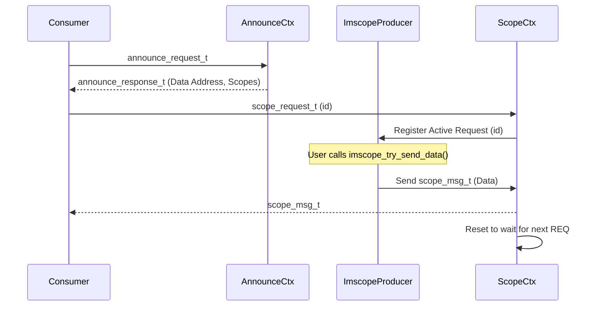

# imscope_producer Analysis and Description

The `imscope_producer` is a core component of the `imscope` project, responsible for providing data to consumers through a high-performance, asynchronous communication layer based on **NNG (Nanomsg Next Gen)**.

## Architecture and Design

The producer is designed around a **REQ/REP** pattern, where the consumer (the "requestor") asks for data, and the producer (the "replier") provides it. This "pull-on-demand" model ensures that consumers only receive data when they are ready to process it, preventing buffer overflows and flow control issues.

### Key Components

- **`ImscopeProducer` (Main Class)**:
    - Orchestrates the entire lifecycle: initialization, scope configuration, socket management, and cleanup.
    - Manages an internal map of `active_requests` to track which workers are waiting to send data.
    - Houses an **Announce Thread** that listens for discovery requests from potential consumers.

- **`ScopeCtx` (Worker Context)**:
    - Encapsulates a single `nng_ctx` (context) for asynchronous I/O.
    - Each `ScopeCtx` runs its own receive/send state machine.
    - Uses asynchronous callbacks (`recv_callback`) to handle incoming requests without blocking the main thread.

- **`AnnounceCtx` (Discovery Handler)**:
    - Operates on the same asynchronous principles as `ScopeCtx`.
    - Responds to `announce_request_t` messages with an `announce_response_t`, which includes the producer's name, data address, and the list of available scopes.

### Data Flow



## API and Usage

The producer provides a C-compatible API for easy integration with other languages and legacy systems.

### Initialization and Configuration

```c
imscope_return_t imscope_init_producer(const char* data_address,
                                      const char* announce_address,
                                      const char* name,
                                      imscope_scope_desc_t* scopes,
                                      size_t num_scopes);
```
Initializes the producer with a name, communication addresses, and a list of scopes.

### Sending Data

There are two primary ways to send data:

1.  **Immediate Send (`imscope_try_send_data`)**:
    Copies data from a user-provided buffer into an NNG message and sends it immediately if a request is pending.
2.  **Zero-Copy / Buffered Send**:
    - **`imscope_acquire_send_buffer`**: Returns a pointer to a pre-allocated NNG message body. The user can write data directly into this buffer.
    - **`imscope_commit_send_buffer`**: Commits the buffer and sends it to the consumer.

## Threading and Synchronization

- **Asynchronous I/O**: The use of NNG contexts (`nng_ctx`) and AIO handles ensures that communication does not block the producer's main execution loop.
- **Mutex Protection**: A `std::mutex` protects the `active_requests` map, which is accessed by both the asynchronous NNG callbacks and the user-facing API.
- **Atomic Operations**: `std::atomic` flags are used for signaling thread termination and tracking request states.
